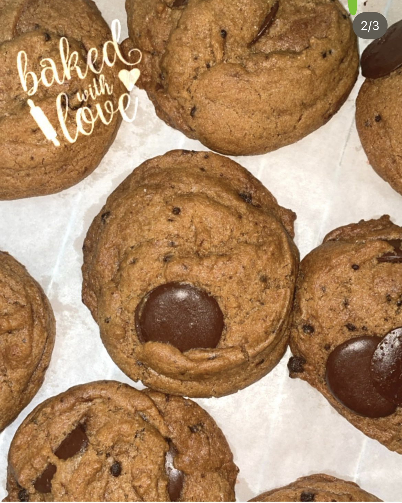
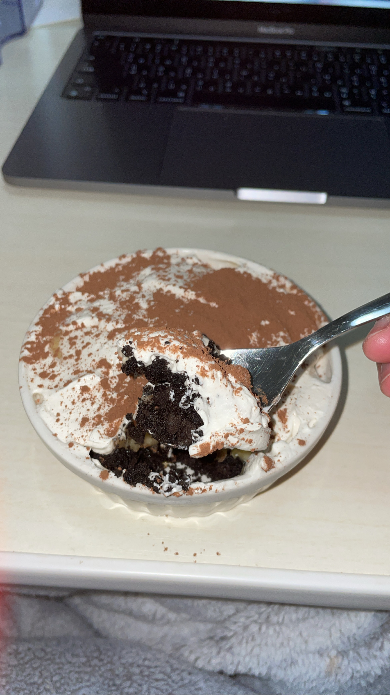
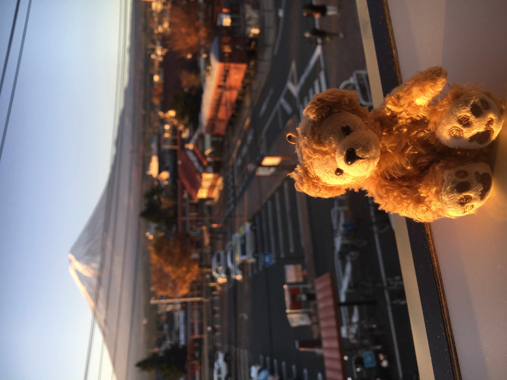
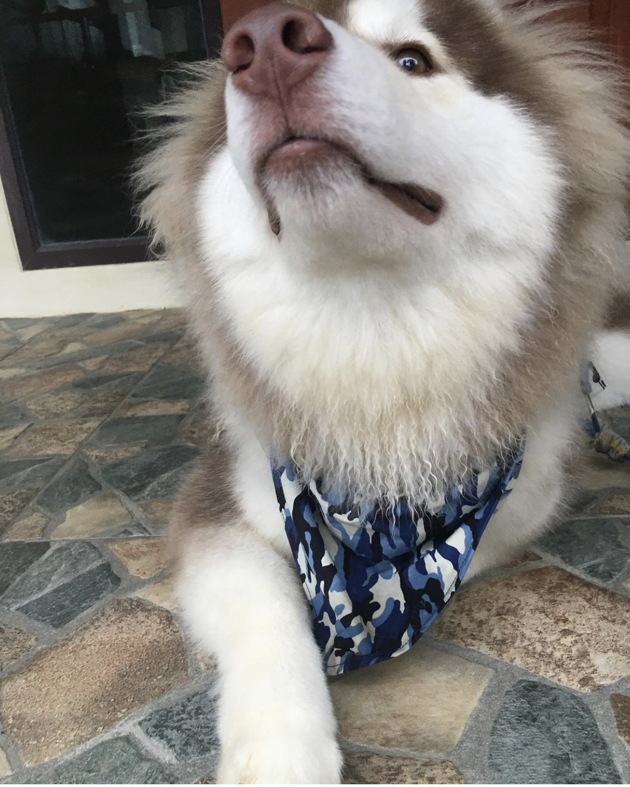

# HELLO
I'm Kratin!

# About me
I'm Naphat Prathumthai, just call me **Kratin**. I'm 20 years old and currently studying at Hokkaido University. I am from Bangkok, Thailand. 

## Leisure
I love **cooking** and **baking** bakery in my free time. Here is my bakery that I made.

## Traveling
I'm passionate about traveling. I have been to Japan, Singapore, South Korea, China, Hongkong. I love traveling to Korea for cafe hopping and enjoying the city. I love the Korean vibe, especially Hongdae and Hangang
Pictures

## Eating Lifestyle
I love exploring new restaurants and cafe. I love eating Asaian food such as Thai, Japanese, Korean food. However, there is one of my secret is that I can't eat vegetables. My favorite food is yakiniku and massaman curry. I love matcha and Thai tea. I also love eating ice cream and gelato, especially caramel and macadamia flavors. 

## My dogs
I have six dogs at my house in Thailand. I have one Siberian Husky named **Bluenight**. He is very fat and naughty!

# Contact
Instragram : _kkratinn_
Mail : kratinnaphat@gmail.com
  
